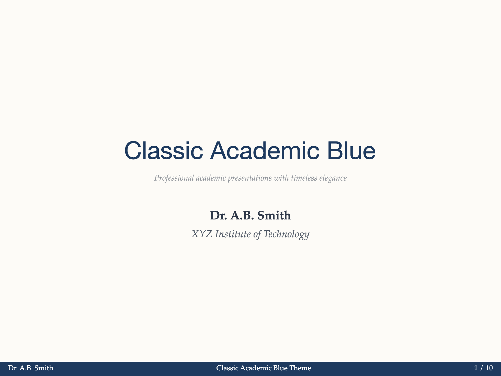
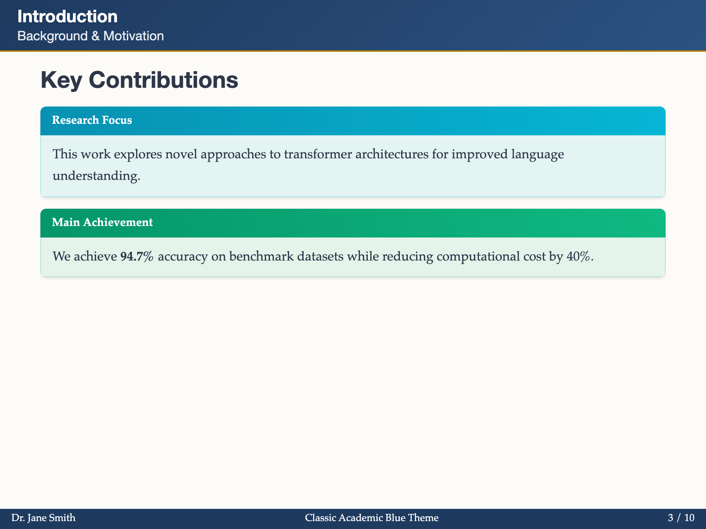
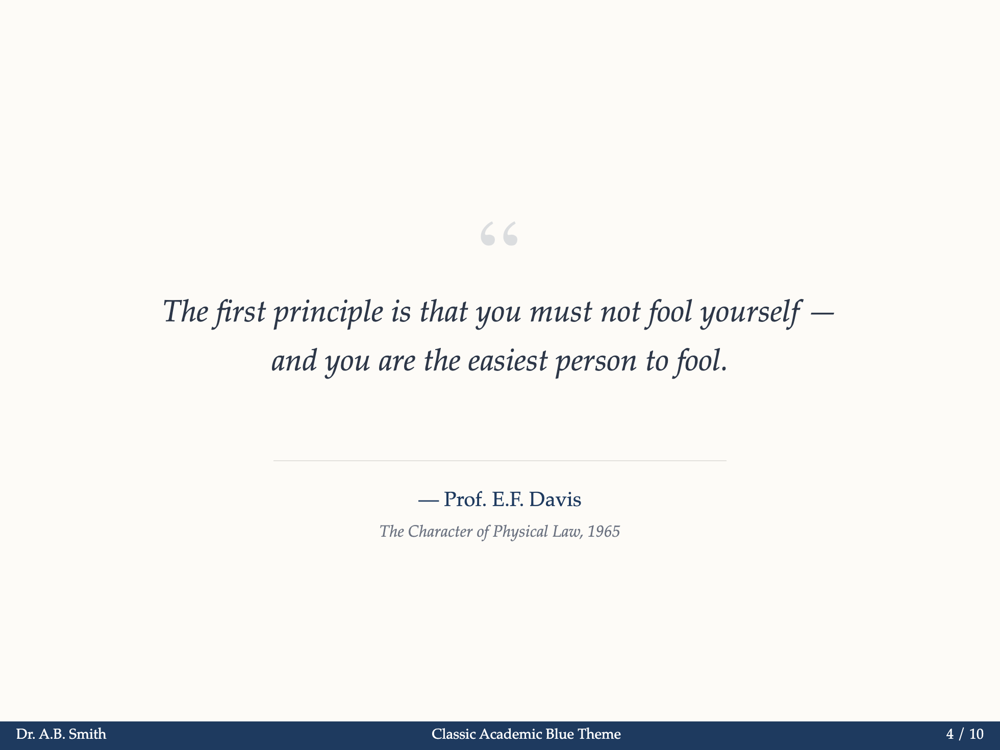
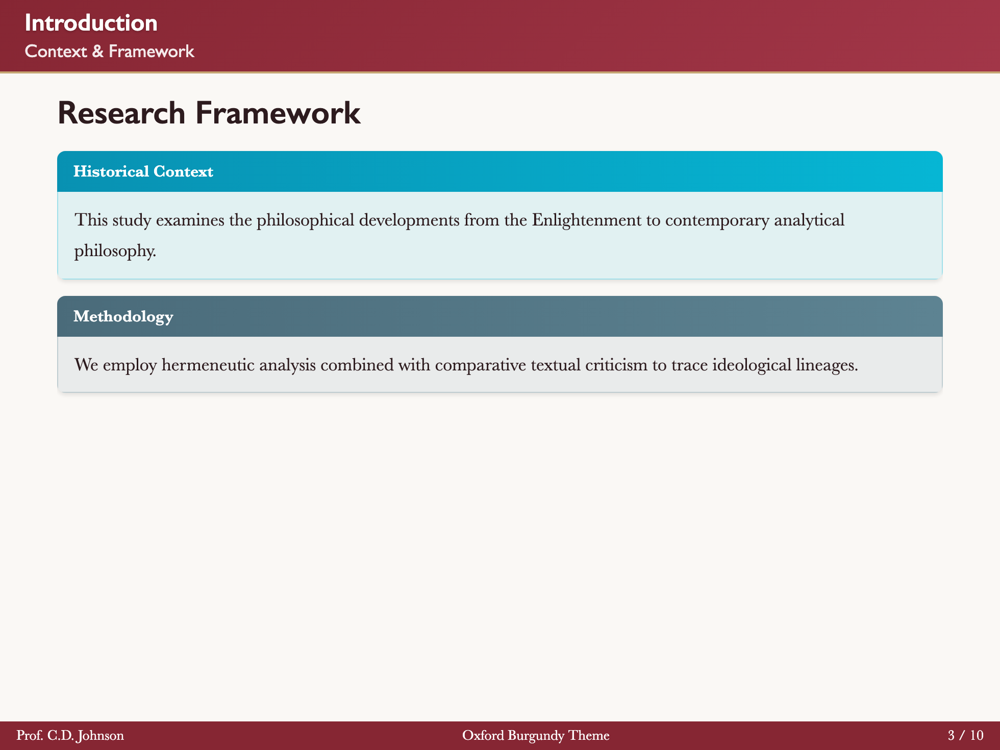
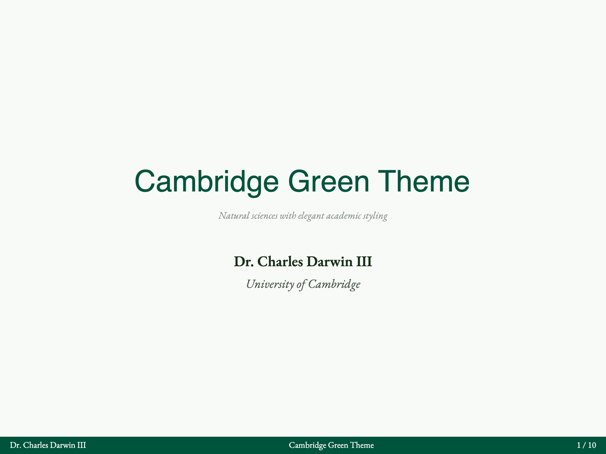
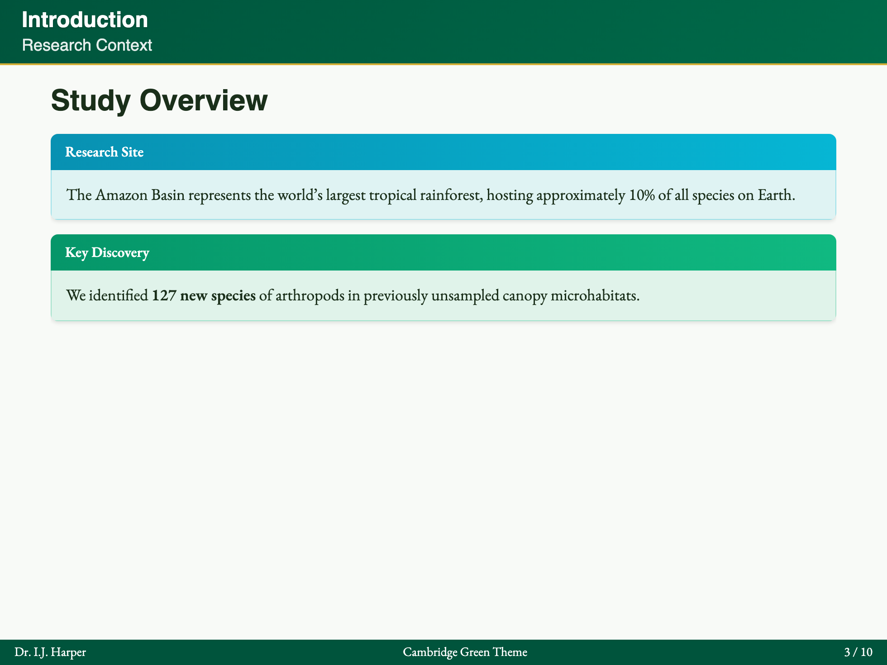
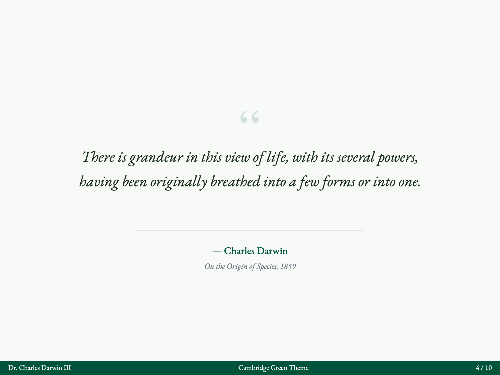

# Slidev Theme Scholarly

[](https://www.npmjs.com/package/slidev-theme-scholarly)
[](https://github.com/jxpeng98/slidev-theme-scholarly)
[](./LICENSE)

[中文版](./README-zh.md) · [Live Demo](https://scholarly.penghu.pro/) · [Documentation](https://github.com/jxpeng98/slidev-theme-scholarly/tree/main/docs/en)

A professional presentation theme for [Slidev](https://sli.dev), designed specifically for academic presentations with LaTeX Beamer-inspired styling.

> **⚠️ Major Upgrade in Progress**
>
> Upcoming versions may include breaking changes. Please check the [Upgrade Notes](./docs/en/guide/upgrade.md) before updating.
>
> **Try the pre-release:**
> ```bash
> npm i -D slidev-theme-scholarly@next
> ```

> **⚠️ Major Upgrade in Progress**
>
> Upcoming versions may include breaking changes (dependencies, theme config, layouts/components). Please check the [Upgrade Notes](https://github.com/jxpeng98/slidev-theme-scholarly/blob/main/docs/en/guide/upgrade.md) before updating.
>
> **Try the pre-release:**
> ```bash
> npm i -D slidev-theme-scholarly@next
> ```

---

## ✨ Key Features

| Feature | Description |
|---------|-------------|
| 🎓 **Professional Design** | LaTeX Beamer-inspired with academic styling |
| 📐 **24 Layouts** | Structure, Content, Emphasis, and Academic categories |
| 🧩 **Rich Components** | Theorem, Block, Citations, Steps, Keywords, Columns, Highlight |
| 🎨 **9 Color Themes** | Classic Blue, Oxford, Cambridge, Yale, Princeton, Nordic, Monochrome, Sepia, High Contrast |
| 📚 **BibTeX Citations** | Automatic bibliography with APA, Harvard, IEEE, MLA styles |
| 📝 **Syntax Sugar** | Simplified Markdown directives for components |
| 🔧 **VS Code Extension** | Snippets, previews, and BibTeX integration |

---

## 🚀 Quick Start

### Installation

```bash
npm i -D slidev-theme-scholarly
```

### Create Your Presentation

```markdown
---
theme: scholarly
authors:
  - name: Your Name
    institution: Your University
footerMiddle: Conference 2026
---

# Your Presentation Title

Subtitle or description

---

# Introduction

- Point 1
- Point 2
- Point 3
```

### Preview

```bash
npx slidev
```

---

## 📐 Layouts

Layouts are organized into **four categories**:

### Structure Layouts

| Layout | Description |
|--------|-------------|
| `cover` | Title slide with authors |
| `default` | Standard content slide |
| `intro` | Section introduction |
| `section` | Chapter divider |
| `center` | Centered content |
| `auto-center` | Auto-centered content |
| `end` | Closing slide |

### Content Layouts

| Layout | Description |
|--------|-------------|
| `two-cols` | Two-column layout |
| `image-left` | Image on left, text on right |
| `image-right` | Image on right, text on left |
| `bullets` | Enhanced bullet list |
| `figure` | Academic figure with caption |
| `split-image` | Split image layout |

### Emphasis Layouts

| Layout | Description |
|--------|-------------|
| `quote` | Styled quotation |
| `fact` | Single fact/statistic |
| `statement` | Important statement |
| `focus` | Focused statement with icon |

### Academic Layouts

| Layout | Description |
|--------|-------------|
| `compare` | Side-by-side comparison |
| `methodology` | Research methodology |
| `results` | Research results |
| `timeline` | Timeline visualization |
| `agenda` | Presentation agenda |
| `acknowledgments` | Acknowledgments |
| `references` | Bibliography |

[View Layout Documentation →](./docs/en/layouts/structure.md)

---

## 🧩 Components

| Component | Description | Example |
|-----------|-------------|---------|
| **Theorem** | Theorems, lemmas, definitions | `<Theorem type="theorem">...</Theorem>` |
| **Block** | Beamer-style info blocks | `<Block type="info">...</Block>` |
| **Citations** | BibTeX citations | `@citekey` or `!@citekey` |
| **Steps** | Process visualization | `<Steps :steps="[...]" />` |
| **Keywords** | Keyword tags | `<Keywords :items="[...]" />` |
| **Columns** | Multi-column layout | `<Columns :cols="2">...</Columns>` |
| **Highlight** | Text highlighting | `<Highlight>text</Highlight>` |

[View Component Documentation →](./docs/en/components/index.md)

---

## 🎨 Theme Gallery

<details open>
<summary><b>Classic Blue (Default)</b></summary>
<table>
  <tr>
    <td></td>
    <td></td>
    <td></td>
    <td></td>
  </tr>
</table>
</details>

At the top of each slide, add:
<details>
<summary><b>Oxford Burgundy</b></summary>
<table>
  <tr>
    <td></td>
    <td></td>
    <td></td>
    <td></td>
  </tr>
</table>
</details>

<details>
<summary><b>Cambridge Green</b></summary>
<table>
  <tr>
    <td></td>
    <td></td>
    <td></td>
    <td></td>
  </tr>
</table>
</details>

<details>
<summary><b>More Themes...</b></summary>

- Yale Blue
- Princeton Orange
- Nordic Blue
- Monochrome
- Warm Sepia
- High Contrast

[View All Themes →](./docs/en/guide/themes.md)
</details>

**Use for:** Most of your slides (this is automatic!)

```markdown
---
title: My Slide Title
subtitle: Optional subtitle
---

# Main Content
## 📚 Documentation

### Getting Started

- [Quick Start](./docs/en/guide/quick-start.md) - Get started in 5 minutes
- [Upgrade Notes](./docs/en/guide/upgrade.md) - Migration guide for major versions
- [Features](./docs/en/guide/features.md) - Overview of all features
- [Configuration](./docs/en/guide/configurations.md) - Theme configuration options
- [Themes](./docs/en/guide/themes.md) - Color and font themes

### Layouts

- [Structure Layouts](./docs/en/layouts/structure.md) - Cover, sections, navigation
- [Content Layouts](./docs/en/layouts/content.md) - Text, images, columns
- [Emphasis Layouts](./docs/en/layouts/emphasis.md) - Quotes, facts, highlights
- [Academic Layouts](./docs/en/layouts/academic.md) - Methodology, results, references

### Components

- [Theorem](./docs/en/components/theorem.md) - Mathematical theorems
- [Block](./docs/en/components/block.md) - Information blocks
- [Citations](./docs/en/components/cite.md) - BibTeX citations
- [Steps](./docs/en/components/steps.md) - Process visualization
- [Keywords](./docs/en/components/keywords.md) - Keyword tags
- [Columns](./docs/en/components/columns.md) - Multi-column layouts
- [Highlight](./docs/en/components/highlight.md) - Text highlighting

### Advanced

- [Syntax Sugar](./docs/en/syntax-sugar.md) - Markdown directives
- [VS Code Extension](./docs/en/guide/vscode-extension.md) - Snippets and tools
- [Examples](./docs/en/examples.md) - Complete examples

---

## 👥 Who is this for?

**Use for:** Major transitions in your presentation
- 👨‍🎓 **PhD students** presenting dissertations and research
- 👩‍🏫 **Professors** creating course lectures
- 🔬 **Researchers** preparing conference talks
- 📊 **Anyone** needing polished academic presentations

**No programming experience required!**

---

## 🔧 VS Code Extension

### Chinese Example
Boost your productivity with our VS Code extension:

- 🎯 Activity Bar panel for layouts/components
- ✨ Snippets: type `ss-` to insert layouts/components
- 📚 BibTeX integration with auto-complete
- 👁️ Preview support

[Download from Releases →](https://github.com/jxpeng98/slidev-theme-scholarly/releases)

---

## 🤝 Contributing

We welcome contributions!

```bash
# Install dependencies
npm install

# Start development server
npm run dev

# Build
npm run build
```

[View Contributing Guide →](./docs/en/contributing.md)

---

## 📄 License

MIT License - see [LICENSE](./LICENSE) for details.

---

## 🔗 Links

- [📖 Documentation](https://github.com/jxpeng98/slidev-theme-scholarly/tree/main/docs/en)
- [🎬 Live Demo](https://scholarly.penghu.pro/)
- [🐛 Issues](https://github.com/jxpeng98/slidev-theme-scholarly/issues)
- [💬 Discussions](https://github.com/slidevjs/slidev/discussions)
- [📦 NPM Package](https://www.npmjs.com/package/slidev-theme-scholarly)

---

**Made with ❤️ for academics around the world**
