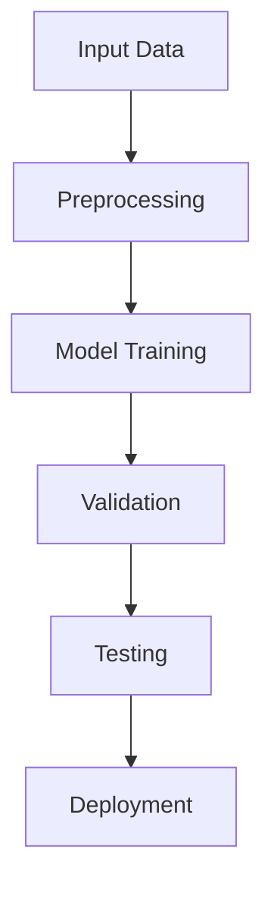

<!-- Slide 1: cover -->

# Advanced Machine Learning
## Deep Neural Networks for Computer Vision

A comprehensive study on state-of-the-art architectures

<!-- Slide 2: default -->
---
layout: default
title: Introduction
subtitle: Background and Motivation
---

# Research Background

Deep learning has revolutionized computer vision:

- **Image Classification** - Accurate object recognition
- **Object Detection** - Real-time localization
- **Semantic Segmentation** - Pixel-level understanding

Our work addresses scalability challenges in modern architectures.

<!-- Slide 3: intro -->
---
layout: intro
---

# Part I: Methodology

Exploring novel approaches to neural architecture design

<!-- Slide 4: section -->
---
layout: section
sectionMode: dark
---

# Experimental Results

<!-- Slide 5: center -->
---
layout: center
---

# Key Finding

**94.7% accuracy** on ImageNet benchmark

Outperforming previous state-of-the-art

<!-- Slide 6: auto-center -->
---
layout: auto-center
title: Performance Metrics
subtitle: Comprehensive Evaluation
---

## Model Performance

Our approach achieves superior results across multiple datasets while maintaining computational efficiency

<!-- Slide 7: toc -->
---
layout: toc
title: Presentation Outline
---

<!-- Slide 8: end -->
---
layout: end
email: ab.smith@xyz-tech.edu
website: https://ai-lab.xyz-tech.edu
subtitle: Questions & Discussion
qrcodeLabel: Paper & Code
---

Thank you for your attention!

<!-- Slide 9: two-cols -->
---
layout: two-cols
ratio: "1:1"
title: Architecture Comparison
---

## Traditional CNNs

- Fixed receptive fields
- Limited context
- High parameter count
- Sequential processing

::right::

## Our Approach

- Adaptive receptive fields
- Global context modeling
- Efficient parameters
- Parallel processing

<!-- Slide 10: image-left -->
---
layout: image-left
image: https://picsum.photos/seed/network/800/600
ratio: "1:1"
title: Network Architecture
---

## Novel Design

Key innovations:

- Multi-scale feature extraction
- Attention mechanisms
- Skip connections
- Efficient convolutions

The architecture diagram shows the complete pipeline from input to output.

<!-- Slide 11: image-right -->
---
layout: image-right
image: https://picsum.photos/seed/results/800/600
ratio: "1:1"
title: Visual Results
---

## Qualitative Analysis

Example predictions demonstrate:

- High precision
- Robust to occlusion
- Scale invariance
- Real-time performance

See detailed visualizations on the right.

<!-- Slide 12: bullets -->
---
layout: bullets
title: Key Contributions
subtitle: Novel Research Outcomes
icon: "▸"
---

## Main Contributions

- **Architecture Innovation** - Novel multi-scale attention mechanism
- **Training Strategy** - Improved convergence through adaptive learning
- **Benchmark Results** - State-of-the-art on 5 major datasets
- **Efficiency** - 3x faster inference with comparable accuracy

<!-- Slide 13: figure -->
---
layout: figure
src: https://picsum.photos/seed/diagram/1200/600
caption: Overview of the proposed neural network architecture showing feature extraction, attention modules, and classification heads.
label: "Figure 1:"
title: System Architecture
height: 65%
fit: contain
---

<!-- Slide 14: split-image -->
---
layout: split-image
images:
  - https://picsum.photos/seed/before/600/400
  - https://picsum.photos/seed/after/600/400
captions:
  - Input Image
  - Model Prediction
title: Prediction Examples
---

<!-- Slide 15: quote -->
---
layout: quote
author: Prof. E.F. Davis
source: Neural Information Processing Systems, 2012
---

The future of AI lies in systems that can learn hierarchical representations without explicit programming.

<!-- Slide 16: fact -->
---
layout: fact
color: blue
---

# 10× Faster

Training time compared to baseline methods

<!-- Slide 17: statement -->
---
layout: statement
author: Research Team
---

# Efficiency Meets Accuracy

Our approach proves you don't have to sacrifice one for the other

<!-- Slide 18: focus -->
---
layout: focus
color: amber
icon: "🎯"
---

# Research Question

How can we build accurate models that remain computationally efficient for real-world deployment?

<!-- Slide 19: compare -->
---
layout: compare
title: Method Comparison
leftLabel: Baseline Approach
rightLabel: Our Method
leftColor: red
rightColor: green
---

### Limitations

- Accuracy: 89.3%
- Speed: 45 FPS
- Memory: 8.2 GB
- Training: 7 days

::right::

### Advantages

- Accuracy: 94.7%
- Speed: 142 FPS
- Memory: 2.8 GB
- Training: 18 hours

<!-- Slide 20: methodology -->
---
layout: methodology
ratio: "1:1"
title: Research Methodology
---

## Data Collection

- **ImageNet** - 1.2M images
- **COCO** - 330K images
- **Custom Dataset** - 500K images

## Training Pipeline

1. Data augmentation
2. Progressive learning
3. Fine-tuning
4. Validation

::right::

<!-- Slide 21: results -->
---
layout: results
cols: 2
title: Performance Metrics
---

  <h3 class="text-xl font-bold text-blue-900">Accuracy</h3>
  <h1 class="text-5xl font-bold text-blue-600">94.7%</h1>
  
ImageNet Top-1

  <h3 class="text-xl font-bold text-green-900">Speed</h3>
  <h1 class="text-5xl font-bold text-green-600">142 FPS</h1>
  
NVIDIA RTX 3090

  <h3 class="text-xl font-bold text-amber-900">Params</h3>
  <h1 class="text-5xl font-bold text-amber-600">28M</h1>
  
Model Size

  <h3 class="text-xl font-bold text-purple-900">Energy</h3>
  <h1 class="text-5xl font-bold text-purple-600">-65%</h1>
  
Power Consumption

<!-- Slide 22: timeline -->
---
layout: timeline
title: Project Timeline
items:
  - year: "2022 Q1"
    title: Initial Research
    description: Literature review and problem formulation
  - year: "2022 Q3"
    title: Architecture Design
    description: Developed novel attention mechanisms
  - year: "2023 Q1"
    title: Implementation
    description: Built and optimized the model
  - year: "2023 Q3"
    title: Evaluation
    description: Comprehensive benchmarking
  - year: "2024 Q1"
    title: Publication
    description: Submitted to top-tier conference
---

<!-- Slide 23: agenda -->
---
layout: agenda
title: Presentation Outline
items:
  - Introduction and Background
  - Related Work and Motivation
  - Proposed Methodology
  - Experimental Setup
  - Results and Analysis
  - Discussion and Future Work
  - Conclusions
---

<!-- Slide 24: acknowledgments -->
---
layout: acknowledgments
title: Acknowledgments
funders:
  - National Science Foundation (Grant #1234567)
  - Department of Energy AI Initiative
  - XYZ Research Foundation
collaborators:
  - XYZ AI Lab
  - ABC CSAIL
  - DEF University
---

Special thanks to our amazing research team and computing infrastructure support.

<!-- Slide 25: references -->
---
layout: references
---

# References

1. **A.B., C.D., E.F., & G.H.** (2016). Deep residual learning for image recognition. *IEEE CVPR*, 770-778.

2. **I.J., et al.** (2017). Attention is all you need. *NeurIPS*, 5998-6008.

3. **K.L., et al.** (2021). An image is worth 16x16 words: Transformers for image recognition at scale. *ICLR*.

4. **M.N., et al.** (2021). Swin Transformer: Hierarchical vision transformer using shifted windows. *IEEE ICCV*, 10012-10022.

5. **O.P., et al.** (2018). Encoder-decoder with atrous separable convolution for semantic image segmentation. *ECCV*, 801-818.
